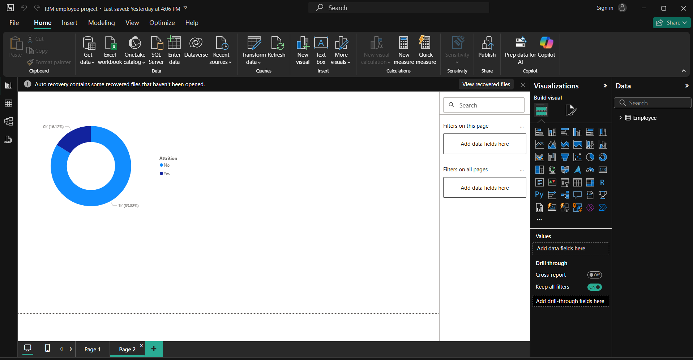

# Employee Attrition Analysis - Power BI Project

This is a self-created Power BI project using the IBM HR Analytics Employee Attrition dataset. The goal is to explore and analyze the key factors influencing employee attrition and to build interactive dashboards for actionable insights.

---

## 📊 Project Overview

- **Tool Used:** Power BI
- **Dataset:** IBM HR Analytics Dataset (open-source)
- **Domain:** Human Resources / Employee Analytics
- **Goal:** Understand attrition trends, identify key drivers, and provide visual insights to help HR teams make informed decisions.

---

## 📌 Key Features

- Attrition analysis by department, job role, education, age, gender, etc.
- KPI cards for quick insights (Attrition Rate, Active Employees, Avg. Monthly Income)
- Advanced DAX calculations for attrition metrics
- Drill-through functionality for detailed employee-level insights
- Heatmap visuals and slicers for interactive filtering
- Clean data model with star schema approach

---

## 📷 Dashboard Preview

``

  

---

## 🧠 Key Learnings

- Completed entire project independently
- Improved skills in DAX, data cleaning, and interactive report design
- Understood business problem-solving using data
- Gained experience in HR domain analytics

---

## 📁 Files Included

- `IBM_Employee_Attrition.xlsx` – Original dataset
- `EmployeeAttrition.pbix` – Power BI report file
- `README.md` – Project documentation

---

## 📬 Contact

If you liked this project or want to collaborate, feel free to connect:

- 🔗 [LinkedIn](https://www.linkedin.com/in/haripriyapallapolu/)
- ✉️ Email: haripriyapallapolu@gmail.com

---

> ⭐ This project is part of my data analytics portfolio. Feedbacks & suggestions are always welcome!
